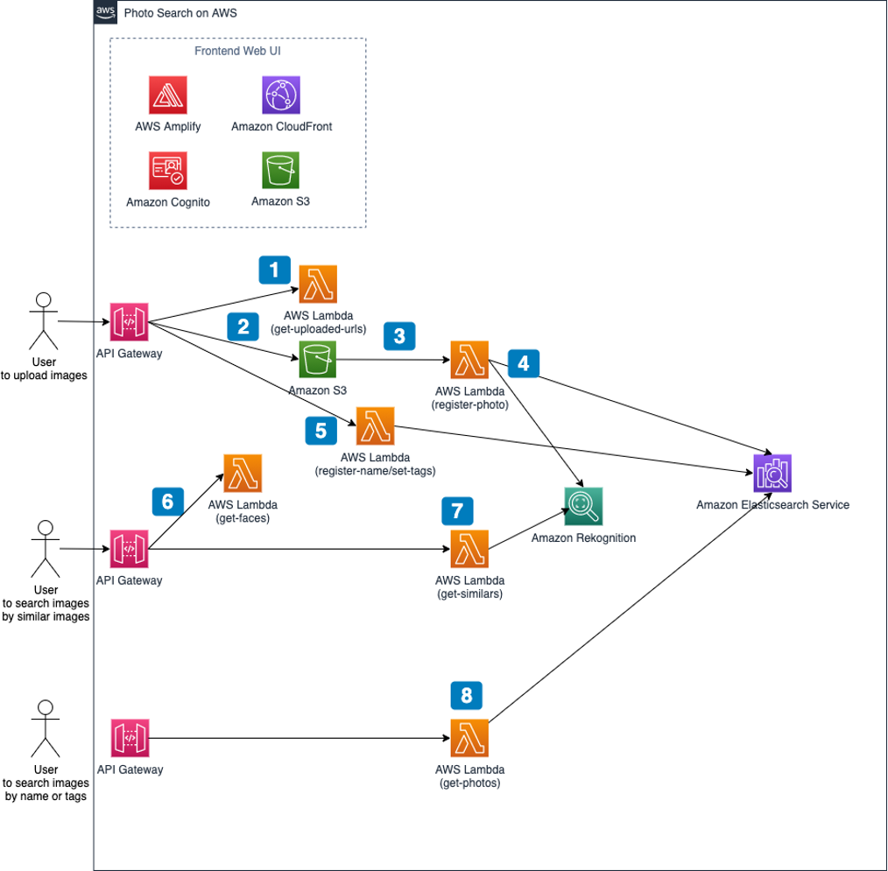

**[🚀 Solution Landing Page](https://aws.amazon.com/solutions/implementations/photo-search-on-aws/)** | **[🚧 Feature request](https://github.com/awslabs/photo-search-on-aws/issues/new?assignees=&labels=feature-request%2C+enhancement&template=feature_request.md&title=)** | **[🐛 Bug Report](https://github.com/awslabs/photo-search-on-aws/issues/new?assignees=&labels=bug%2C+triage&template=bug_report.md&title=)**

Note: If you want to use the solution without building from source, navigate to Solution Landing Page

## Table of contents

- [Solution Overview](#solution-overview)
- [Architecture Diagram](#architecture-diagram)
- [AWS CDK Constructs](#aws-solutions-constructs)
- [Customizing the Solution](#customizing-the-solution)
  - [Prerequisites for Customization](#prerequisites-for-customization)
  - [Build](#build)
  - [Unit Test](#unit-test)
  - [Deploy](#deploy)
- [File Structure](#file-structure)
- [Collection of operational metrics](#collection-of-operational-metrics)
- [License](#license)

<a name="solution-overview"></a>
# Solution Overview
The Photo search on AWS solution helps you build an application that organizes and search for images.

This solution comes with a web interface that you can expand and customize easily. So by deploying this solution, you are able to develop a photo organizing application quickly and easily.

Please refer to [Implementation Guide](https://docs.aws.amazon.com/solutions/latest/photo-search-on-aws/welcome.html) for the detail of this solution.

<a name="architecture-diagram"></a>
# Architecture Diagram
Deploying this solution with the default parameters builds the following environment in the AWS Cloud. The overall architecture of the solution has the following key components.


<p align="center">
  
  <br/>
</p>

Please refer to [Implementation Guide](https://docs.aws.amazon.com/solutions/latest/photo-search-on-aws/architecture-overview.html) for the detail of this architecture.


<a name="aws-solutions-constructs"></a>
# AWS Solutions Constructs
[AWS CDK Solutions Constructs](https://aws.amazon.com/solutions/constructs/) make it easier to consistently create well-architected applications. All AWS Solutions Constructs are reviewed by AWS and use best practices established by the AWS Well-Architected Framework. This solution uses the following AWS CDK Constructs:

-   aws-apigateway-lambda
-   aws-cloudfront-s3
-   aws-s3-lambda


<a name="customizing-the-solution"></a>
# Customizing the Solution
The solution can be deployed through the CloudFormation templates available on the solution home page: Photo Search on AWS. To make changes to the solution, using the below steps download or clone this repo, update the source code and then run the deployment/build-s3-dist.sh script to deploy the updated codes to an Amazon S3 bucket in your account.

<a name="prerequisites-for-customization"></a>
## Prerequisites for Customization
- [Node.js](https://nodejs.org/en/)
- [AWS Configuration and credential file settings](https://docs.aws.amazon.com/cli/latest/userguide/cli-configure-files.html)
- [AWS CLI version 2](https://docs.aws.amazon.com/cli/latest/userguide/install-cliv2.html)


<a name="build"></a>
## Build
### Configure the bucket name of your target Amazon S3 distribution bucket
```
export DIST_OUTPUT_BUCKET=my-dist-bucket-name
export SOLUTION_NAME=photo-search-on-aws
export VERSION=my-version
export TEMPLATE_OUTPUT_BUCKET=my-template-bucket-name
export REGION=my-region
```
<!-- - Parameter details -->
|Parameter|Description|
|- |- |
|DIST_OUTPUT_BUCKET|This is the global name of the distribution. For the bucket name, the AWS Region is added to the global name (example: 'my-bucket-name-us-east-1') to create a regional bucket. The lambda artifact should be uploaded to the regional buckets for the CloudFormation template to pick it up for deployment.|
|SOLUTION_NAME|The name of This solution (example: photo-search-on-aws)|
|VERSION|The version number of the change|
|TEMPLATE_OUTPUT_BUCKET|The name of the S3 bucket where the CloudFormation templates should be uploaded|
|||


### Create a regional bucket and a global bucket.
```
aws s3 create-bucket --bucket $DIST_OUTPUT_BUCKET-$REGION
aws s3 create-bucket --bucket $TEMPLATE_OUTPUT_BUCKET
```
- When creating and using buckets it is recommeded to:
  - Use randomized names or uuid as part of your bucket naming strategy.
  - Ensure buckets are not public.
  - Verify bucket ownership prior to uploading templates or code artifacts.

### Now build the distributable:
```
cd <rootDir>/deployment
chmod +x ./build-s3-dist.sh
./build-s3-dist.sh $DIST_OUTPUT_BUCKET $SOLUTION_NAME $VERSION $TEMPLATE_OUTPUT_BUCKET
```

<a name="unit-test"></a>
## Unit Test
```
cd <rootDir>/source
chmod +x ./run-all-tests.sh
./run-all-tests.sh
```

<a name="deploy"></a>
## Deploy
### Deploy artifacts
Deploy the distributable to an Amazon S3 bucket in your account. Note: you must have the AWS Command Line Interface installed.
```
aws s3 cp ./global-s3-assets/ s3://$TEMPLATE_OUTPUT_BUCKET/$SOLUTION_NAME/$VERSION/ --recursive --acl bucket-owner-full-control
aws s3 cp ./regional-s3-assets/ s3://$DIST_OUTPUT_BUCKET-$REGION/$SOLUTION_NAME/$VERSION/ --recursive --acl bucket-owner-full-control
```

### Deploy with CloudFormation
- Navigate to [CloudFormation](https://console.aws.amazon.com/cloudformation/home?#/stacks/create/template).
- Use the template generated in $TEMPLATE_OUTPUT_BUCKET


<a name="file-structure"></a>
# File structure

Photo Search on AWS consists of:

- CDK constructs to generate necessary resources
- Backend components used in the solution
- React App for the demo usage

<pre>
.
├── deployment                      [folder containing build scripts]
│   ├── build-s3-dist.sh            [build script to build the solution]
│   └── cdk-solution-helper         [helper function to help deploy lambda function code through S3 buckets]
└── source                          [source code containing CDK App and React App]
    ├── backend                     [folder containing CDK App and components for backend services]
    │   ├── bin                     [entrypoint of the CDK application]
    │   ├── lambda                  [folder containing source code the lambda functions]
    │   └── lib                     [folder containing cdk nested stacks]
    ├── frontend                    [folder containing React App]
    └── run-all-tests.sh            [helper script to run all tests in backend and frontend]
</pre>


<a name="termsandconditions"></a>
# Terms & Conditions
This solution uses AWS services. Please read [the terms & conditions](https://aws.amazon.com/service-terms/) too.

<a name="license"></a>
# License

See license [here](https://github.com/awslabs/Photo-search-on-aws/blob/master/LICENSE.txt) 


